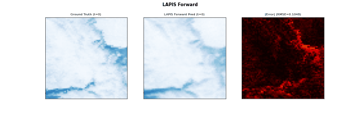
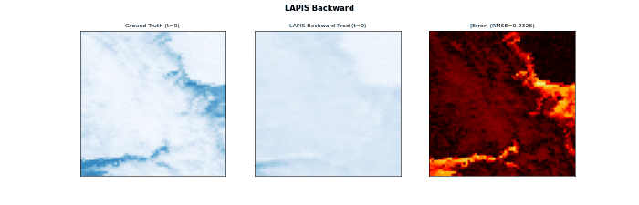

# LAPIS-SHRED

**LAtent Phase Inference from Short time sequences using Shallow REcurrent Decoders**

**LAPIS-SHRED** reconstructs or forecasts complete spatiotemporal dynamics from sparse sensor measurements confined to a short temporal window. It operates through a three-stage pipeline: 

(i) a SHRED model is pre-trained entirely on simulation data to map sensor time-histories into a structured latent space, 

(ii) a temporal sequence model, also trained on simulation-derived latent trajectories, learns to propagate latent states forward or backward in time to span unobserved temporal regions from short observational time windows, and 

(iii) at deployment, only a short observation window of hyper-sparse sensor measurements from the true system is provided, from which the frozen SHRED model and the temporal model jointly reconstruct or forecast the complete spatiotemporal trajectory.

The framework supports bidirectional (in time) inference, inherits data assimilation and multiscale reconstruction capabilities from its modular structure, and accommodates extreme observational constraints including single-frame terminal inputs. 

## Repository Structure

```
LAPIS-SHRED/
├── README.md
├── LICENSE
├── data/
│   └── data_generation_ndsi.py      # MODIS NDSI download (Sierra Nevada)
├── model/
│   ├── shred_jax/                   # Shared JAX/Flax ML library
│   │   ├── shred.py                 # SHRED models, losses, metrics
│   │   ├── datasets.py              # Ensemble dataset classes
│   │   ├── temporal_models.py       # Forward/Backward temporal models
│   │   ├── training.py              # Training loops
│   │   ├── inference.py             # LAPIS inference pipelines
│   │   └── utils.py                 # Sensor placement, logging
│   ├── visualizations/              # Plotting utilities
│   │   ├── results_grid.py          # Shared GT/LAPIS/SHRED comparison figure
│   │   ├── timeseries.py            # Per-sensor time-series plots
│   │   └── ndsi_plots.py            # NDSI-specific visualizations
│   └── lapis_ndsi.py                # NDSI snow cover experiment
├── quick_startup/                   # NDSI example
└── demo_videos/                     # NDSI example visualizations
```

## Requirements

```
jax
jaxlib
flax
optax
numpy
scikit-learn
scipy
matplotlib
earthengine-api   # for data download only
```

## Usage - e.g. NDSI

**1. Download data** (requires Google Earth Engine account):
```bash
cd data
python data_generation_ndsi.py --project_id YOUR_GEE_PROJECT
```

**2. Run experiment:**
```bash
cd model
python lapis_ndsi.py                             # backward (default)
python lapis_ndsi.py --inference_mode forward    # forward
python lapis_ndsi.py --shred_mode frame          # frame-by-frame SHRED
```

All configuration is set at the top of `lapis_ndsi.py`.

**3. Output Files**

Results are saved to `results_forward/` or `results_backward/`:

| File | Description |
|------|-------------|
| `pred_lapis.npy` | LAPIS reconstructed fields |
| `pred_shred.npy` | SHRED baseline fields |
| `lapis_ndsi_metrics.json` | RMSE, SSIM, NRMSE |
| `lapis_ndsi_results.png` | GT / LAPIS / SHRED comparison |
| `timeseries_comparison.png` | Per-sensor time-series |
| `scaf_diagnostics.png` | SCAF endpoint cutting |
| `gifs/`, `videos/` | Reconstruction animations |

## Demo Videos




## Citation

```
Paper under review.
```
